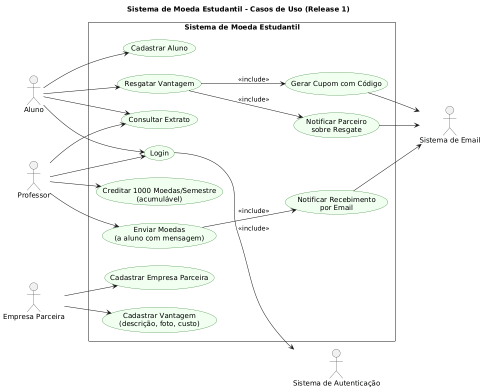

# Sistema de Moeda Estudantil

Este projeto é um sistema desenvolvido para incentivar o reconhecimento do mérito estudantil por meio de uma **moeda virtual**. O sistema contempla funcionalidades para **alunos, professores e empresas parceiras**, incluindo modelagem UML, autenticação, controle de saldo e comunicação via e-mail.

## Sumário
- [Visão Geral](#visão-geral)
- [Funcionalidades](#funcionalidades)
- [Estrutura do Projeto](#estrutura-do-projeto)
- [Como Executar](#como-executar)
- [Banco de Dados](#banco-de-dados)
- [Documentação](#documentação)
- [Autores](#autores)

---

## Visão Geral
O **Sistema de Moeda Estudantil** visa criar um ambiente digital onde professores podem **premiar alunos** com moedas virtuais por bom comportamento e desempenho acadêmico. Os alunos podem **trocar essas moedas** por vantagens oferecidas por empresas parceiras, como **descontos em produtos ou serviços**.

O projeto está dividido em **três sprints principais (Lab03S01, S02 e S03)** e segue uma **arquitetura MVC**, com documentação UML e integração entre frontend e backend.

---

## Funcionalidades
- Cadastro e autenticação de usuários (aluno, professor e empresa parceira)  
- Envio de moedas de professores para alunos com mensagens personalizadas  
- Consulta de extrato de transações (envios, recebimentos e resgates)  
- Cadastro de vantagens por empresas parceiras (com descrição, foto e custo em moedas)  
- Resgate de vantagens por alunos, com geração automática de **cupom e código**  
- Notificação por e-mail para aluno e empresa após o resgate  
- Crédito automático de **1.000 moedas por semestre** para cada professor  
- Arquitetura **MVC** e integração entre frontend e backend  

---

## Estrutura do Projeto
```
SistemaDeMoedaEstudantil/
├── Backend/                     # API Java (Spring Boot)
│   ├── pom.xml
│   ├── src/
│   └── ...
├── Codigo/                      # Frontend (React + TypeScript)
│   ├── package.json
│   ├── src/
│   └── ...
├── database_schema.sql          # Estrutura do banco de dados
├── Documentacao/                # Diagramas UML e documentação do projeto
│   ├── DiagramaCasosDeUso.puml
│   ├── DiagramaDeClasses.puml
│   ├── DiagramaDeComponentes.puml
│   ├── HistoriasDeUsuario.md
│   └── ...
└── CONEXAO_FRONTEND_BACKEND.md  # Guia de integração
```

---

## Como Executar

### Backend (Java + Spring Boot)
1. Acesse a pasta `Backend`.
2. Configure o banco de dados em `application.yml`.
3. Execute:
   ```sh
   ./mvnw spring-boot:run
   ```
   ou use o script `run-backend.bat` (Windows).

### Frontend (React + Vite)
1. Vá até a pasta `Codigo`.
2. Instale as dependências:
   ```sh
   npm install
   ```
3. Crie um arquivo `.env` com a URL da API:
   ```env
   VITE_API_URL=http://localhost:8080/api
   ```
4. Execute o servidor:
   ```sh
   npm run dev
   ```

---

## Banco de Dados
O arquivo `database_schema.sql` define as tabelas principais:
- `Aluno`, `Professor`, `EmpresaParceira`, `Vantagem`, `Transacao`, `Cupom`, `Instituicao`.
- Relacionamentos seguem a modelagem UML, com suporte a **ORM (JPA/Hibernate)** na camada Java.

---

## Documentação

### Diagramas Disponíveis
Os seguintes diagramas estão na pasta `Documentacao/`:

- 
- 
- 
- 

---

### Histórias de Usuário

#### Aluno
- Quero me cadastrar informando meus dados pessoais e curso para participar do sistema.  
- Quero consultar meu extrato de moedas para acompanhar recebimentos e resgates.  
- Quero resgatar vantagens e receber um cupom com código por e-mail.  

#### Professor
- Quero enviar moedas para alunos, incluindo uma mensagem obrigatória.  
- Quero visualizar meu saldo e extrato de transações.  
- Quero receber automaticamente 1.000 moedas por semestre, acumuláveis.  

#### Empresa Parceira
- Quero me cadastrar e cadastrar vantagens com descrição, foto e custo em moedas.  
- Quero receber e-mails com código de confirmação quando um aluno resgatar uma vantagem.  

#### Sistema
- Precisa autenticar usuários e enviar notificações automáticas por e-mail.  

---

## Autores
- Projeto desenvolvido por **AulusHZP** e colaboradores.  
- **Professor orientador:** João Paulo Carneiro Aramuni  
- **Disciplina:** Laboratório de Desenvolvimento de Software – Engenharia de Software – 4º Período  

---

Sinta-se à vontade para contribuir ou sugerir melhorias!
