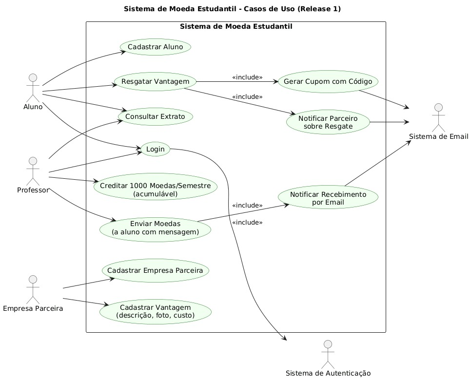
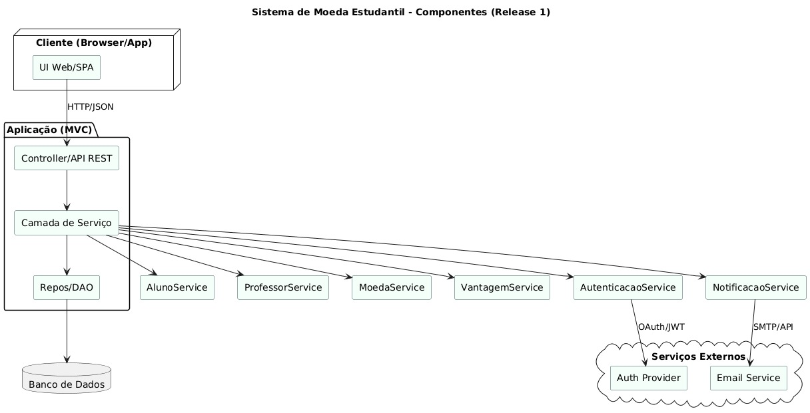
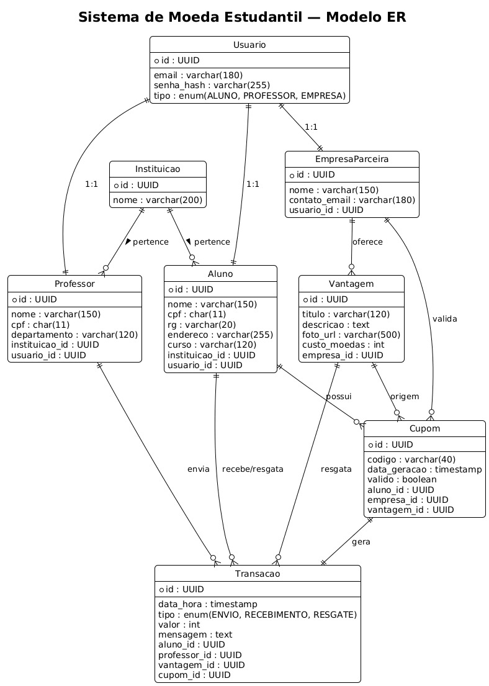
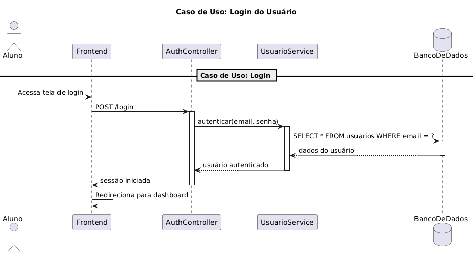
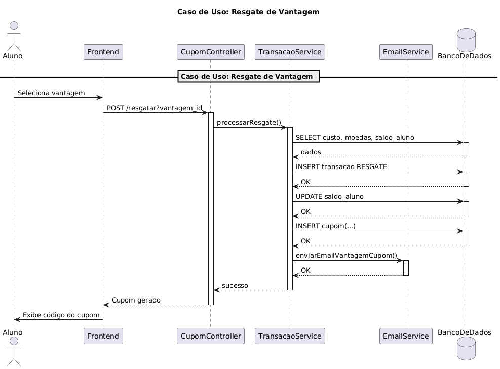

# 🪙 Sistema de Moeda Estudantil - Spring Boot Backend

## Visão Geral

Sistema completo de moedas virtuais para reconhecimento estudantil desenvolvido com **Spring Boot** e **React**. Professores podem distribuir moedas para alunos por bom desempenho, e os alunos podem trocar essas moedas por vantagens oferecidas por empresas parceiras.

## 📊 Diagramas e Arquitetura

### Diagrama de Casos de Uso


O diagrama de casos de uso ilustra as principais interações entre os atores do sistema (Aluno, Professor, Empresa) e suas funcionalidades.

### Diagrama de Classes


Estrutura completa das classes do sistema, demonstrando as entidades principais, seus atributos e relacionamentos.

### Diagrama de Componentes


Arquitetura do sistema mostrando a separação entre frontend (React), backend (Spring Boot), banco de dados (PostgreSQL) e serviços externos.

### Diagrama Entidade-Relacionamento (ER)


Modelo de dados completo mostrando todas as tabelas, chaves primárias, estrangeiras e cardinalidades.

### Diagramas de Sequência

#### Sequência de Login


Fluxo detalhado do processo de autenticação, desde a entrada de credenciais até a geração do token JWT.

#### Sequência de Resgate de Vantagem


Fluxo completo do resgate de vantagens, incluindo validações, atualização de saldo, geração de cupom e notificações por email.

## 🎯 Funcionalidades

### Para Alunos
- **Dashboard personalizado** com saldo de moedas
- **Catálogo de vantagens** oferecidas por empresas parceiras
- **Sistema de resgate** com cupons únicos
- **Histórico completo** de transações e resgates
- **Interface intuitiva** para navegação

### Para Professores
- **Distribuição de moedas** para alunos por mérito
- **Sistema de reconhecimento** com motivos personalizados
- **Controle de saldo** próprio de moedas
- **Histórico de envios** e acompanhamento

### Para Empresas
- **Criação de vantagens** personalizadas
- **Gestão de ofertas** com custos em moedas
- **Controle de estoque** e disponibilidade
- **Acompanhamento de resgates** realizados

## 🛠️ Tecnologias Utilizadas

### Backend
- **Spring Boot 3.2.0** - Framework Java
- **Spring Security** - Autenticação e autorização
- **Spring Data JPA** - Persistência de dados
- **PostgreSQL** - Banco de dados
- **JWT** - Tokens de autenticação
- **Spring Mail** - Envio de emails
- **Maven** - Gerenciamento de dependências

### Frontend
- **React 18** + TypeScript + Vite
- **shadcn/ui** + Tailwind CSS + Lucide Icons
- **React Router DOM** - Roteamento
- **React Hook Form** + Zod - Formulários e validação
- **Sonner** - Notificações

## 🚀 Como Executar

### Pré-requisitos

- **Java 17+** instalado
- **Maven** instalado
- **PostgreSQL** instalado e rodando
- **Node.js 18+** instalado

### 1. Configurar Banco de Dados

```sql
-- Criar banco de dados
CREATE DATABASE moeda_estudantil;

-- Executar o schema
\i Backend/database_schema.sql
```

### 2. Executar Backend

```bash
# Navegar para o diretório do backend
cd Backend

# Executar o Spring Boot
mvn spring-boot:run

# Ou usar o script
./run-backend.bat  # Windows
./run-backend.ps1  # PowerShell
```

O backend estará disponível em: `http://localhost:8080`

### 3. Executar Frontend

```bash
# Navegar para o diretório do frontend
cd Codigo/star-exchange-platform-main

# Instalar dependências
npm install

# Criar arquivo de ambiente
cp env.example .env

# Executar o frontend
npm run dev
```

O frontend estará disponível em: `http://localhost:5173`

## 📋 API Endpoints

### Autenticação
- `POST /api/auth/login` - Login
- `POST /api/auth/register` - Registro

### Instituições
- `GET /api/institutions` - Listar instituições
- `GET /api/institutions/{id}` - Buscar instituição

### Professor
- `POST /api/professor/send-coins` - Enviar moedas
- `GET /api/professor/transactions` - Histórico de envios
- `GET /api/professor/students/{institutionId}` - Listar alunos
- `GET /api/professor/students/search` - Buscar alunos

### Aluno
- `POST /api/student/redeem` - Resgatar vantagem
- `GET /api/student/transactions` - Histórico de recebimentos
- `GET /api/student/redemptions` - Histórico de resgates

### Empresa
- `POST /api/company/advantages` - Criar vantagem
- `GET /api/company/advantages` - Listar vantagens da empresa
- `PUT /api/company/advantages/{id}` - Atualizar vantagem
- `DELETE /api/company/advantages/{id}` - Deletar vantagem
- `GET /api/company/redemptions` - Histórico de resgates

### Vantagens (Público)
- `GET /api/advantages` - Listar vantagens disponíveis
- `GET /api/advantages/affordable/{maxCost}` - Vantagens acessíveis
- `GET /api/advantages/{id}` - Buscar vantagem

## 🗄️ Estrutura do Banco de Dados

### Diagrama ER - Visão Geral


### Tabelas Principais
- **`institutions`** - Instituições de ensino (PUC Minas, UFMG, etc.)
- **`profiles`** - Perfis de usuários (base para todos os tipos)
- **`students`** - Dados específicos dos alunos (RG, endereço, curso)
- **`professors`** - Dados específicos dos professores (CPF, departamento)
- **`companies`** - Dados das empresas parceiras
- **`advantages`** - Vantagens/ofertas disponíveis
- **`transactions`** - Histórico de transferências de moedas
- **`redemptions`** - Histórico de resgates de vantagens

### Relacionamentos
- **Profile → Institution**: Um perfil pode estar vinculado a uma instituição (1:N)
- **Student → Profile**: Herança - cada estudante é um perfil (1:1)
- **Professor → Profile**: Herança - cada professor é um perfil (1:1)
- **Company → Profile**: Herança - cada empresa é um perfil (1:1)
- **Transaction**: Professor envia moedas para Aluno (N:1:1)
- **Redemption**: Aluno resgata Vantagem (N:1:1)
- **Advantage → Company**: Vantagens pertencem a empresas (N:1)

## 🔧 Configuração

### Variáveis de Ambiente

#### Backend (`application.yml`)
```yaml
spring:
  datasource:
    url: jdbc:postgresql://localhost:5432/moeda_estudantil
    username: postgres
    password: postgres

jwt:
  secret: mySecretKey123456789012345678901234567890
  expiration: 86400000

spring:
  mail:
    host: smtp.gmail.com
    port: 587
    username: ${MAIL_USERNAME:your-email@gmail.com}
    password: ${MAIL_PASSWORD:your-app-password}
```

#### Frontend (`.env`)
```env
VITE_API_URL=http://localhost:8080/api
```

## 📁 Estrutura do Projeto

### Arquitetura de Componentes


### Organização de Diretórios

```
MoedaEstudantil/
├── Backend/                     # Spring Boot Backend (API REST)
│   ├── src/main/java/com/moedaestudantil/
│   │   ├── controller/          # Controllers REST (endpoints da API)
│   │   ├── service/            # Lógica de negócio
│   │   ├── repository/         # Repositórios JPA (acesso ao BD)
│   │   ├── model/              # Entidades JPA
│   │   ├── dto/                # Data Transfer Objects
│   │   ├── config/             # Configurações (CORS, Security)
│   │   └── security/           # JWT, autenticação
│   ├── database_schema.sql     # Schema completo do PostgreSQL
│   ├── pom.xml                 # Dependências Maven
│   └── run-backend.bat/ps1     # Scripts de execução
├── Codigo/star-exchange-platform-main/  # Frontend React + TypeScript
│   ├── src/
│   │   ├── components/          # Componentes reutilizáveis (UI)
│   │   ├── pages/              # Páginas da aplicação
│   │   ├── services/           # Chamadas à API
│   │   ├── hooks/              # Hooks customizados
│   │   └── config/             # Configurações do frontend
│   ├── package.json            # Dependências NPM
│   └── vite.config.ts          # Configuração Vite
└── Documentação/               # Documentação técnica
    ├── diagramaCasosDeUso.jpg      # Casos de uso
    ├── diagramaClasse.jpg          # Diagrama de classes
    ├── diagramaComponentes.jpg     # Arquitetura de componentes
    ├── diagramaER.jpg              # Modelo de dados
    ├── diagramaDeSequenciaLogin.png        # Fluxo de login
    └── diagramaDeSequenciaVantagem.png     # Fluxo de resgate
```

## 🔐 Segurança

- **JWT Tokens** para autenticação
- **BCrypt** para hash de senhas
- **CORS** configurado para frontend
- **Validação** de dados com Bean Validation
- **Autorização** baseada em roles

## 📧 Notificações

O sistema envia emails automáticos para:
- **Alunos**: Confirmação de resgate com código do cupom
- **Empresas**: Notificação de novo resgate realizado

## 🧪 Dados de Teste

O schema inclui dados de exemplo:
- **Instituições**: PUC Minas, UFMG, UEMG, UFV, UFOP
- **Usuário de teste**: 
  - Email: `aluno1@test.com`
  - Senha: `password123`
  - Tipo: Aluno


## 📚 Documentação Adicional

### Diagramas UML Disponíveis

Todos os diagramas estão localizados na pasta `Documentação/`:

1. **Casos de Uso** (`diagramaCasosDeUso.jpg`) - Interações entre atores e funcionalidades
2. **Classes** (`diagramaClasse.jpg`) - Estrutura orientada a objetos
3. **Componentes** (`diagramaComponentes.jpg`) - Arquitetura do sistema
4. **ER** (`diagramaER.jpg`) - Modelo de dados relacional
5. **Sequência - Login** (`diagramaDeSequenciaLogin.png`) - Fluxo de autenticação
6. **Sequência - Vantagem** (`diagramaDeSequenciaVantagem.png`) - Fluxo de resgate

### Fluxos Principais

#### Fluxo de Autenticação (Login)
1. Usuário envia credenciais (email/senha)
2. Backend valida no banco de dados
3. Sistema gera token JWT
4. Frontend armazena token
5. Requisições subsequentes incluem token no header

#### Fluxo de Envio de Moedas (Professor → Aluno)
1. Professor seleciona aluno e valor
2. Sistema valida saldo do professor
3. Debita moedas do professor
4. Credita moedas ao aluno
5. Registra transação no histórico
6. Atualiza saldos em tempo real

#### Fluxo de Resgate de Vantagem (Aluno)
1. Aluno navega no catálogo de vantagens
2. Seleciona vantagem desejada
3. Sistema valida saldo do aluno
4. Debita moedas do aluno
5. Gera código de cupom único
6. Envia email ao aluno com cupom
7. Notifica empresa parceira
8. Registra resgate no histórico

## 👥 Autores

Desenvolvido como parte do projeto de **Laboratório de Projeto de Software**.

---

## 📄 Licença

Este projeto foi desenvolvido para fins acadêmicos.

---

**Sistema completo com Backend Spring Boot** substituindo Supabase, com todas as funcionalidades mantidas e melhoradas! 🚀