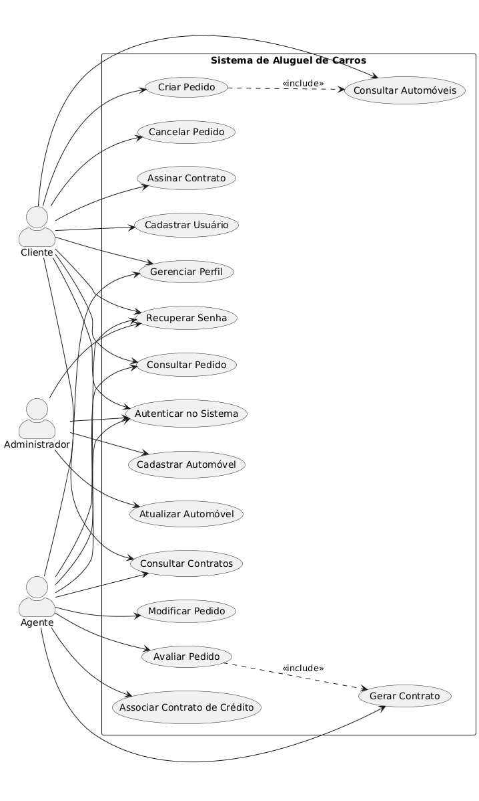
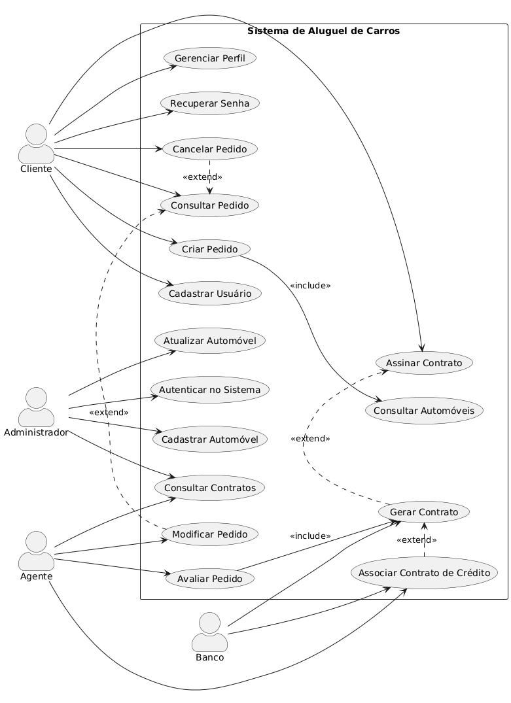
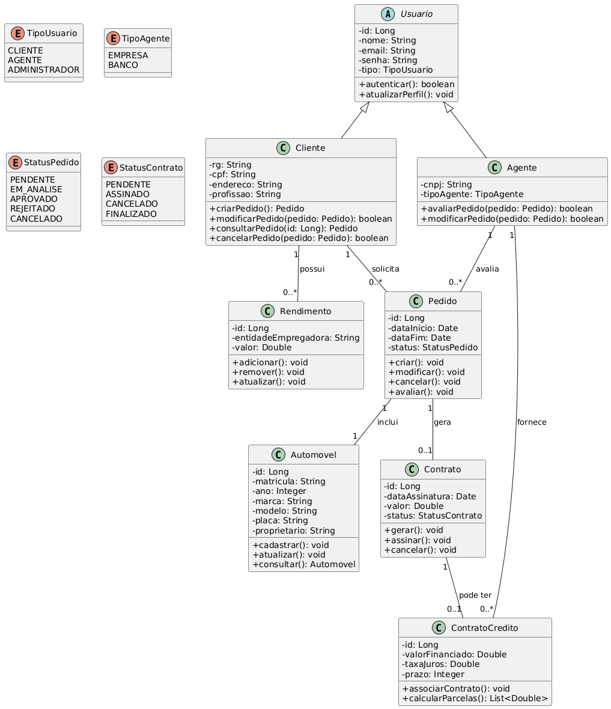
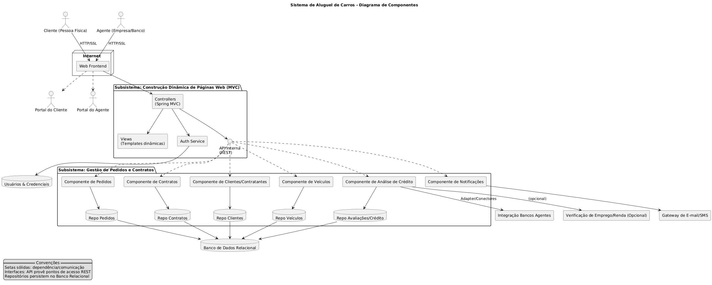

# Sistema de Aluguel de Carros

Este projeto é um sistema completo para gerenciamento de aluguel de carros, incluindo frontend (React + TypeScript) e backend (Java + Spring Boot), além de documentação e scripts de banco de dados.

## Sumário
- [Visão Geral](#visão-geral)
- [Funcionalidades](#funcionalidades)
- [Estrutura do Projeto](#estrutura-do-projeto)
- [Como Executar](#como-executar)
- [Banco de Dados](#banco-de-dados)
- [Documentação](#documentação)
- [Autores](#autores)

---

## Visão Geral
O sistema permite que clientes solicitem o aluguel de veículos, agentes aprovem ou rejeitem pedidos e administradores gerenciem o sistema. O frontend é desenvolvido em React com Vite, e o backend em Java Spring Boot.

## Funcionalidades
- Cadastro e autenticação de usuários (cliente, agente, administrador)
- Cadastro e listagem de veículos
- Solicitação de pedidos de aluguel
- Aprovação e rejeição de pedidos
- Visualização de histórico de pedidos
- Interface moderna e responsiva

## Estrutura do Projeto
```
SistemaDeAluguelDeCarros/
├── Backend/                # Backend Java Spring Boot
│   ├── pom.xml
│   ├── src/
│   └── ...
├── Código/                 # Frontend React + TypeScript
│   ├── package.json
│   ├── src/
│   └── ...
├── database_schema.sql     # Script SQL do banco de dados
├── Documentacao/           # Diagramas e documentação
│   └── ...
└── CONEXAO_FRONTEND_BACKEND.md # Guia de integração
```

## Como Executar

### Backend (Java + Spring Boot)
1. Acesse a pasta `Backend`.
2. Configure o banco de dados em `application.yml` ou `application-postgres.yml`.
3. Execute:
   ```sh
   ./mvnw spring-boot:run
   ```
   ou use o script `run-backend.bat` (Windows) ou `run-backend.ps1` (PowerShell).

### Frontend (React + Vite)
1. Acesse a pasta `Código`.
2. Instale as dependências:
   ```sh
   npm install
   ```
3. Crie um arquivo `.env` com a URL da API, se necessário:
   ```env
   VITE_API_URL=http://localhost:8080/api
   ```
4. Execute o frontend:
   ```sh
   npm run dev
   ```

## Banco de Dados
- O script `database_schema.sql` contém a estrutura do banco de dados.
- Use PostgreSQL ou outro banco compatível.


## Documentação

### Diagramas Disponíveis
Os seguintes diagramas estão disponíveis na pasta `Documentacao/`:

- 
- 
- 
- 

### Histórias de Usuário
As histórias de usuário estão documentadas em [`Documentacao/HistóriaDeUsuário.md`](Documentacao/HistóriaDeUsuário.md). Exemplos:

#### Cliente
- Quero me cadastrar no sistema fornecendo meus dados pessoais para acessar os serviços de aluguel de carros.
- Quero criar um pedido de aluguel selecionando o automóvel e período para solicitar um carro quando precisar.
- Quero consultar o status dos meus pedidos de aluguel para acompanhar se foram aprovados ou rejeitados.

#### Agente
- Quero avaliar pedidos de aluguel pendentes para aprovar ou rejeitar solicitações conforme análise financeira.
- Quero associar contratos de crédito a aluguéis aprovados para financiar os clientes que precisam de suporte financeiro.

#### Administrador
- Quero gerenciar cadastros de usuários para manter o sistema organizado e atualizado.
- Quero cadastrar novos automóveis no sistema para disponibilizá-los para aluguel.

Consulte o arquivo completo para todas as histórias de usuário.

- O arquivo `CONEXAO_FRONTEND_BACKEND.md` explica como conectar frontend e backend.

## Autores
- Projeto desenvolvido por AulusHZP e colaboradores.

---

Sinta-se à vontade para contribuir ou sugerir melhorias!
