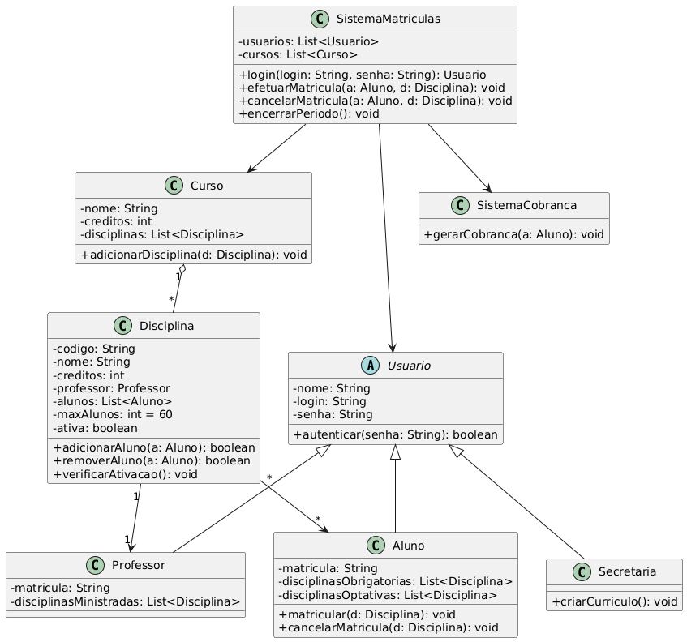

## Sistema de Matrículas — README do Projeto

### Visão geral
Este repositório contém o projeto do Sistema de Matrículas de uma universidade, desenvolvido como parte da disciplina Laboratório de Desenvolvimento de Software (Engenharia de Software). O objetivo é projetar e implementar um protótipo funcional em Java, alinhado aos modelos UML e às regras de negócio definidas.

- **Curso**: Engenharia de Software
- **Disciplina**: Laboratório de Desenvolvimento de Software
- **Professor(a)**: João Paulo Carneiro Aramuni
- **Período**: 4º

### Escopo funcional (requisitos)
O sistema deve permitir que a secretaria mantenha o currículo por semestre e as informações de disciplinas, professores e alunos. Principais funcionalidades:

- **Gestão de cursos**: cadastro de curso com nome e quantidade de créditos.
- **Gestão de disciplinas**: criação/edição de disciplinas, vínculo a curso e professor, capacidade máxima (60) e verificação de ativação.
- **Gestão de alunos**: cadastro e autenticação de alunos.
- **Matrícula**:
  - Durante o período de matrícula, aluno escolhe até 4 disciplinas obrigatórias (1ª opção) e até 2 optativas (alternativas).
  - Aluno pode cancelar matrículas no período vigente.
  - Notificação ao sistema de cobranças após confirmação de matrícula do semestre.
- **Consulta de professores**: professores visualizam a lista de alunos matriculados por disciplina.
- **Autenticação**: todos os usuários acessam via login com senha.

### Regras de negócio
- Uma disciplina só é ativada para o semestre se, ao final do período de matrículas, tiver pelo menos 3 alunos matriculados; caso contrário, é cancelada.
- Cada disciplina pode ter no máximo 60 alunos; ao atingir 60, novas matrículas são bloqueadas.
- Aluno pode selecionar até 4 disciplinas obrigatórias e até 2 optativas no semestre.
- Matrículas e cancelamentos só podem ocorrer dentro do período de matrícula.

### Entregas por sprint (Lab01)
- **Lab01S01 (4 pts)**: Modelo de Análise
  - Diagrama de Caso de Uso do sistema.
  - Histórias de Usuário documentadas em Markdown no repositório.
- **Lab01S02 (4 pts)**: Projeto Estrutural
  - Correções dos diagramas.
  - Diagrama de Classes do sistema.
  - Criação do projeto Java: classes, atributos e stubs dos métodos modelados.
- **Lab01S03 (7 pts)**: Protótipo do Sistema
  - Correções dos diagramas.
  - Implementação das principais funcionalidades com interface (CLI permitida) e persistência (arquivos permitidos).

Consulte o cronograma: [Cronograma no GitHub](https://github.com/joaopauloaramuni/laboratorio-de-desenvolvimento-de-software/tree/main/CRONOGRAMA).

### Critérios de avaliação
- Qualidade do sistema produzido e aderência aos requisitos.
- Alinhamento entre modelos (classes e arquitetura) e código.
- Atualizações dos modelos conforme necessidade do projeto.
- Observação: Há desconto de 1,0 ponto por dia de atraso. A presença semanal do grupo para apresentar o andamento é obrigatória; ausência implica perda automática de 50% dos pontos da sprint.

### Artefatos de análise e design
- **Diagrama de Caso de Uso**: veja a imagem em `./Documentacao/DiagramaCasoDeUso.jpg`.

  

- **Histórias de Usuário**: veja `./Documentacao/HistóriaDeUsuario.md`.
- **Diagrama de Classes**: será adicionado em `./Documentacao/DiagramaDeClasse.png`.
  

### Modelo de domínio inicial (proposta)
- Entidades principais: `Curso`, `Disciplina`, `Aluno`, `Professor`, `Matricula`, `PeriodoDeMatricula`, `Usuario`, `Cobranca`.
- Associações relevantes:
  - `Curso` 1–N `Disciplina`
  - `Professor` 1–N `Disciplina`
  - `Aluno` N–N `Disciplina` via `Matricula` (com status e prioridade/ordem de escolha)
  - `PeriodoDeMatricula` determina se ações de matrícula/cancelamento são permitidas

### Arquitetura e tecnologias
- **Linguagem**: Java (versão sugerida: 17+)
- **Interface**: linha de comando (CLI) na primeira versão
- **Persistência**: arquivos (JSON/CSV/seriação) na primeira versão
- **Camadas sugeridas**:
  - `domain` (entidades e regras)
  - `usecase/service` (casos de uso: matricular, cancelar, consultar)
  - `infrastructure` (persistência em arquivos; gateways)
  - `interface/cli` (menus, entrada/saída)

### Estrutura de pastas sugerida
```
SistemaDeMatricula/
  Documentacao/
    DiagramaCasoDeUso.jpg
    HistóriaDeUsuario.md
    DiagramaDeClasses.png
  src/
    main/java/
      br/ufxx/sistemadematriculas/
        domain/
        usecase/
        infrastructure/
        cli/
    test/java/
  build/ (gerado pela ferramenta)
  Readme.md
```

### Instruções para executar (proposta)
Escolha a ferramenta de build preferida. Exemplo com Maven e com Gradle.

- Maven:
  1. `mvn -v` (verifique instalação)
  2. `mvn clean package`
  3. `java -jar target/sistema-de-matriculas.jar`

- Gradle:
  1. `gradle -v` (verifique instalação)
  2. `./gradlew clean build`
  3. `java -jar build/libs/sistema-de-matriculas.jar`

Caso o projeto não utilize empacotamento ainda, execute a classe principal diretamente pela IDE ou com `javac/java`.

### Casos de uso principais
- Autenticar usuário (aluno/professor/secretaria)
- Manter cursos e disciplinas (secretaria)
- Abrir/encerrar período de matrícula (secretaria)
- Matricular-se em disciplinas (aluno)
- Cancelar matrícula (aluno)
- Consultar alunos por disciplina (professor)
- Notificar cobrança após matrícula (sistema → cobrança)

### Checklist de conformidade (rápido)
- [ ] Requisitos e regras de negócio cobertos
- [ ] Diagrama de Caso de Uso em `Documentacao/`
- [ ] Histórias de Usuário em `Documentacao/`
- [ ] Diagrama de Classes (Sprint 02)
- [ ] Projeto Java criado com stubs (Sprint 02)
- [ ] Protótipo com CLI e persistência em arquivos (Sprint 03)
- [ ] Repositório atualizado a cada sprint

### Contribuição e boas práticas
- Commits frequentes e descritivos.
- Atualizar os modelos UML ao evoluir o código.
- Validar regras de negócio com casos de teste simples (unitários/integrados).

### Licença
Defina a licença do projeto (ex.: MIT) conforme orientação da disciplina.


